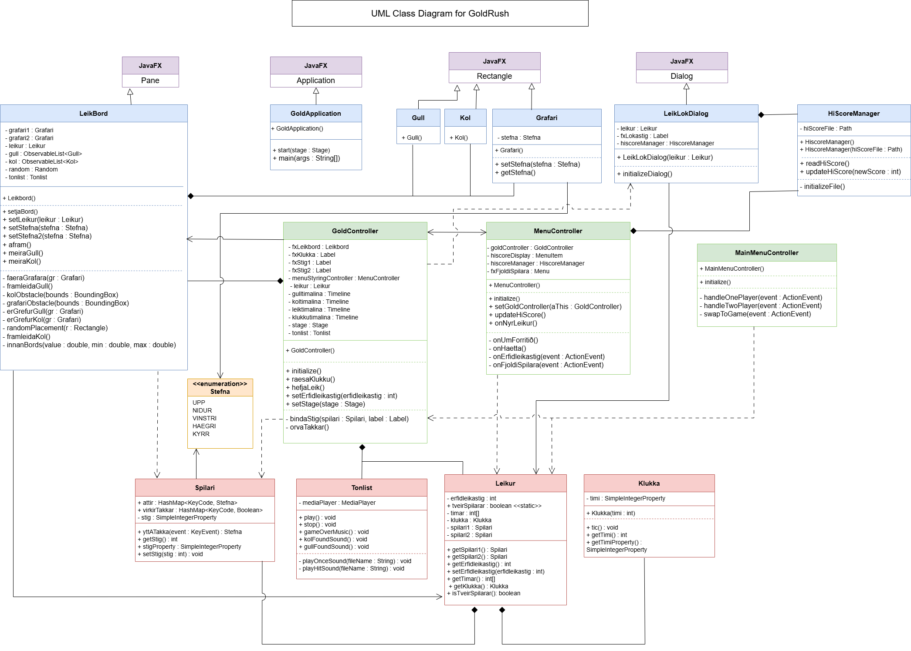

# Design Documentation

## UML Class Diagram

The project has two packages. The `vidmot` package contains all the UI classes: `GoldApplication`, `GoldController`, `MainMenuController`, `MenuController`, `Leikbord`, `Grafari`, `Gull`, `Kol`, `LeiklokDialog`, `HiScoreManager`, and the `Stefna` enum. The `vinnsla` package contains the business logic: `Leikur`, `Spilari`, `Klukka`, and `Tonlist`.

---

## Design Patterns

### Observer Pattern

The Observer pattern is used to keep the UI in sync with the game state without the model knowing anything about the UI.

`Spilari` and `Klukka` act as the subjects — they expose their score and time as `SimpleIntegerProperty` fields. `GoldController` acts as the observer by registering listeners on these properties. When the score or time changes, the labels on screen update automatically.

For example, in `GoldController.bindaStig()`, the score label is bound to the player's `stigProperty()`. A listener also changes the label colour to red when the score goes negative. None of this requires `Spilari` to know anything about the label or the controller.

### MVC Pattern

The project follows MVC. The `vinnsla` package is the model:
`Leikur`, `Spilari`, `Klukka`, and `Tonlist` handle all game logic and state. The view is made up of the FXML files and the visual classes like `Leikbord`, `Grafari`, `Gull`, and `Kol`. The controllers (`GoldController`, `MainMenuController`, `MenuController`) sit between them, handling input and wiring the model to the view.
